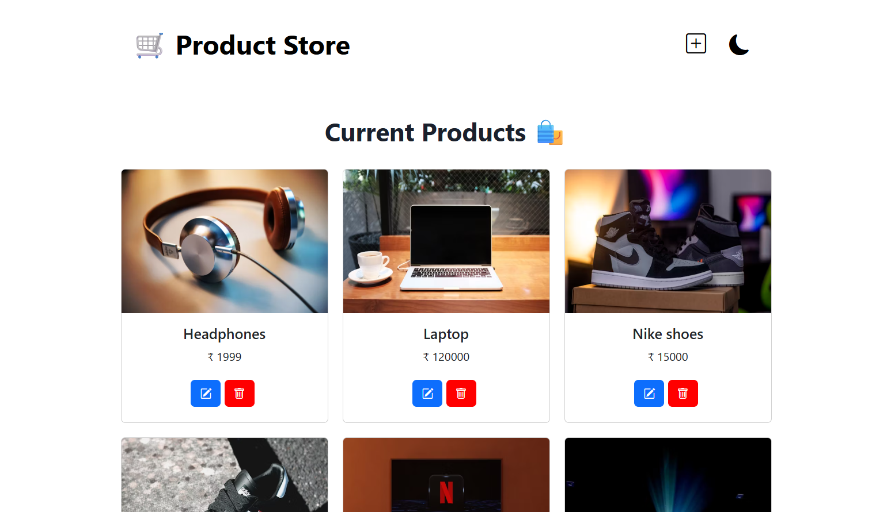
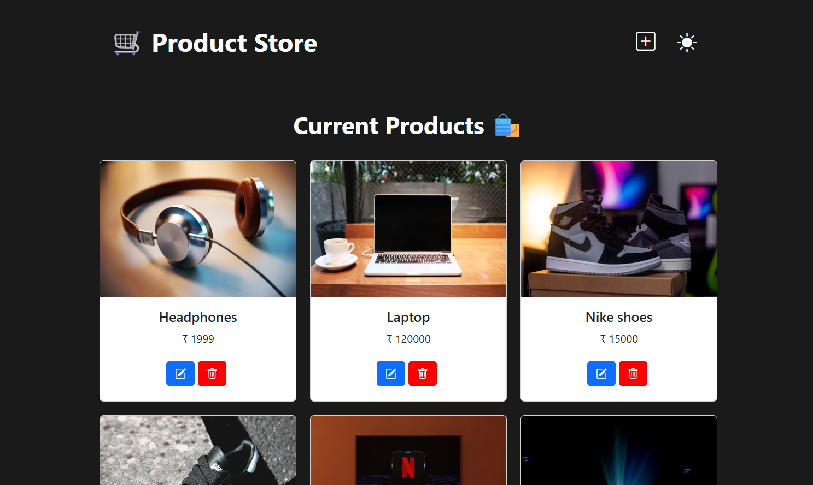
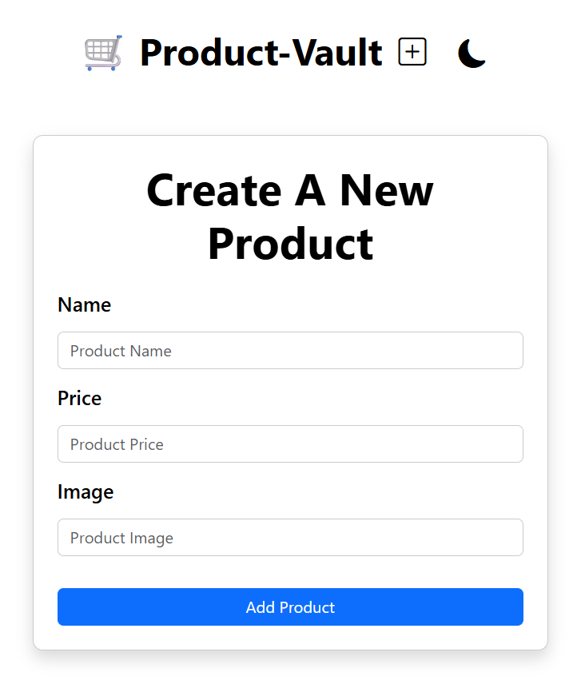

# 🛒 Product Vault

**Product Vault** is a full-stack MERN application for managing products with full **CRUD functionality**, toast notifications, and a clean, responsive UI built using **React**, **Express**, **MongoDB**, and **Bootstrap**. It’s perfect for showcasing modern web development skills with both frontend and backend integration.

## ✨ Features

- ✅ Add, edit, delete, and view products
- 🌗 Dark mode toggle
- 📱 Responsive layout with Bootstrap
- 🔔 Toast notifications for actions (success/failure)
- ⚙️ State management with Zustand
- 🌐 Deployed on Render  (https://product-vault-106b.onrender.com/)

---

## 🧰 Tech Stack

| Frontend  | Backend   | Tools / Libraries |
|-----------|-----------|-------------------|
| React     | Node.js   | Zustand (state)   |
| Bootstrap | Express   | dotenv            |
|           | MongoDB   | nodemon           |

---

## 📁 Folder Structure

`product-vault/`  
  ├── `frontend/` – React App  
  ├── `backend/` – Express Server  
  ├── `.env` – Environment Variables  
  ├── `package.json` – Root Scripts (build, start)

## 🔐 Environment Setup
### Create a .env file in the root:
 `PORT=5000`
 `MONGO_URI=your-mongodb-uri-here`

## 📦 Scripts

### Run these from the root:

### Install dependencies
`npm install`

### Build frontend
`npm run build`

### Start backend (serves built frontend)
`npm start`

## 🚀 Deployment on Render
`Build command: npm run build`
`Start command: npm start`
`Environment variables:`
    `PORT`
    `MONGO_URI`
## 📸 Screenshots

### 🏠 Home Page

### 🌙 Dark Mode Enabled

### 📱 Responsive Layout (+create page)

